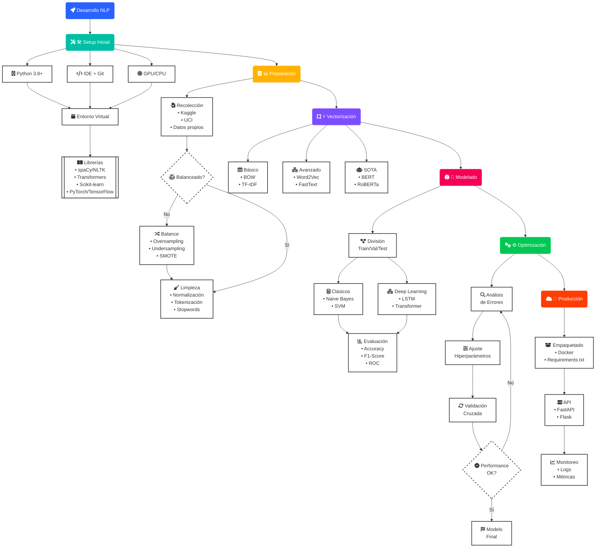

```mermaid
flowchart TD
%% Nodos principales
    Start("fa:fa-rocket Desarrollo NLP")
    
    %% Setup y sus subnodos
    Setup("fa:fa-tools 🛠️ Setup Inicial")
    S1["fa:fa-python Python 3.8+"]
    S2["fa:fa-code IDE + Git"]
    S3["fa:fa-microchip GPU/CPU"]
    S4["fa:fa-box Entorno Virtual"]
    S5[["fa:fa-book-open Librerías<br>• spaCy/NLTK<br>• Transformers<br>• Scikit-learn<br>• PyTorch/TensorFlow"]]

    %% Datos y sus subnodos
    Data("fa:fa-database 📊 Preparación")
    D1["fa:fa-file-import Recolección<br>• Kaggle<br>• UCI<br>• Datos propios"]
    D2{"fa:fa-balance-scale Balanceado?"}
    D3["fa:fa-random Balance<br>• Oversampling<br>• Undersampling<br>• SMOTE"]
    D4["fa:fa-broom Limpieza<br>• Normalización<br>• Tokenización<br>• Stopwords"]

    %% Vectorización y sus subnodos
    Vector("fa:fa-vector-square ⚡ Vectorización")
    V1["fa:fa-table Básico<br>• BOW<br>• TF-IDF"]
    V2["fa:fa-network-wired Avanzado<br>• Word2Vec<br>• FastText"]
    V3["fa:fa-robot SOTA<br>• BERT<br>• RoBERTa"]

    %% Modelado y sus subnodos
    Model("fa:fa-brain 🤖 Modelado")
    M1["fa:fa-project-diagram División<br>Train/Val/Test"]
    M2["fa:fa-calculator Clásicos<br>• Naive Bayes<br>• SVM"]
    M3["fa:fa-network-wired Deep Learning<br>• LSTM<br>• Transformer"]
    M4["fa:fa-chart-bar Evaluación<br>• Accuracy<br>• F1-Score<br>• ROC"]

    %% Optimización y sus subnodos
    Opt("fa:fa-cogs ⚙️ Optimización")
    O1["fa:fa-search Análisis<br>de Errores"]
    O2["fa:fa-sliders-h Ajuste<br>Hiperparámetros"]
    O3["fa:fa-sync Validación<br>Cruzada"]
    O4{"fa:fa-check-circle Performance<br>OK?"}
    O5["fa:fa-flag-checkered Modelo<br>Final"]

    %% Despliegue y sus subnodos
    Deploy("fa:fa-cloud 🚀 Producción")
    Dep1["fa:fa-box-open Empaquetado<br>• Docker<br>• Requirements.txt"]
    Dep2["fa:fa-server API<br>• FastAPI<br>• Flask"]
    Dep3["fa:fa-chart-line Monitoreo<br>• Logs<br>• Métricas"]

%% Conexiones principales
    Start --> Setup
    Setup --> Data
    Data --> Vector
    Vector --> Model
    Model --> Opt
    Opt --> Deploy

%% Conexiones Setup
    Setup --> S1 & S2 & S3 --> S4 --> S5

%% Conexiones Datos
    Data --> D1 --> D2
    D2 -->|No| D3 --> D4
    D2 -->|Sí| D4

%% Conexiones Vectorización
    Vector --> V1 & V2 & V3

%% Conexiones Modelado
    Model --> M1 --> M2 & M3
    M2 & M3 --> M4

%% Conexiones Optimización
    Opt --> O1 --> O2 --> O3 --> O4
    O4 -->|No| O1
    O4 -->|Sí| O5

%% Conexiones Despliegue
    Deploy --> Dep1 --> Dep2 --> Dep3

%% Estilos
style Start fill:#2962FF,stroke:#2962FF,color:#FFF
style Setup fill:#00BFA5,stroke:#00BFA5,color:#FFF
style Data fill:#FFB300,stroke:#FFB300,color:#FFF
style Vector fill:#7C4DFF,stroke:#7C4DFF,color:#FFF
style Model fill:#F50057,stroke:#F50057,color:#FFF
style Opt fill:#00C853,stroke:#00C853,color:#FFF
style Deploy fill:#FF3D00,stroke:#FF3D00,color:#FFF

%% Estilos de subnodos
classDef subnode fill:#FFF,stroke:#333,stroke-width:2px
classDef decision fill:#FFF,stroke:#333,stroke-width:2px,stroke-dasharray: 5 5
class S1,S2,S3,S4,S5,D1,D3,D4,V1,V2,V3,M1,M2,M3,M4,O1,O2,O3,O5,Dep1,Dep2,Dep3 subnode
class D2,O4 decision
```